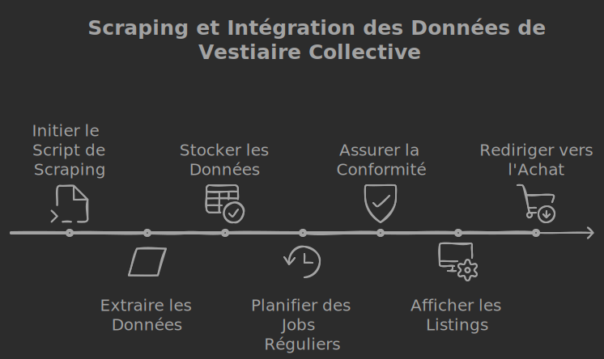
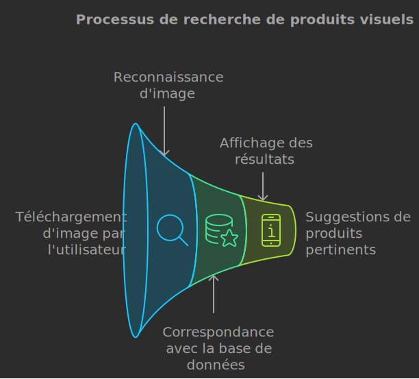
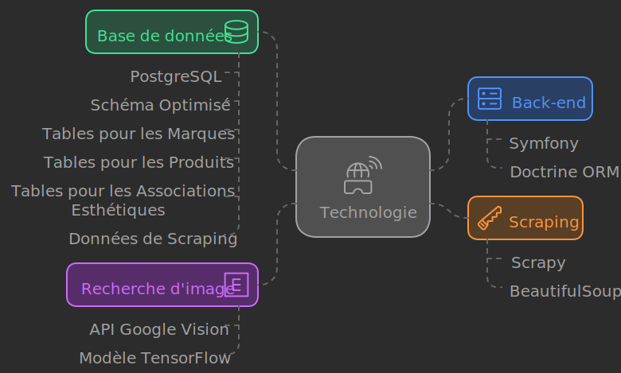
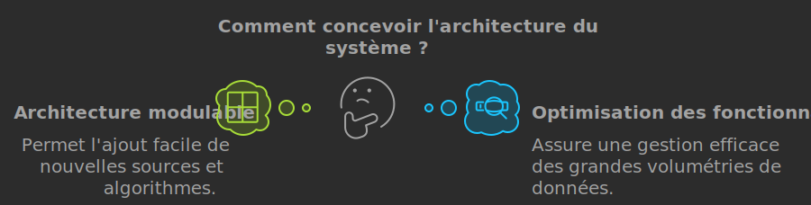
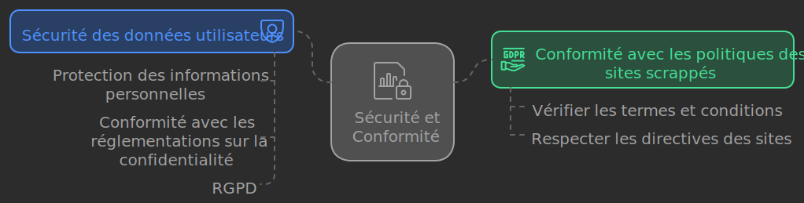

### Cahier des charges : Plateforme de Vente de Vêtements de Marque de Designers

#### Contexte général du projet :

L'objectif de ce projet est de développer une plateforme permettant aux utilisateurs de rechercher, découvrir et acheter des vêtements de marques de designers. Elle intégrera plusieurs fonctionnalités avancées, notamment la recherche par tags, des associations d'esthétiques entre marques, ainsi que l'intégration de pièces à vendre via du scraping et la recherche de produits par images. La base de données sera alimentée par un corpus provenant de différentes sources, notamment des plateformes de vente de vêtements comme Vestiaire Collective.

---

### 1. **Fonctionnalités existantes**

#### Feature 1 : **Recherche des marques de designer par tag, mots-clés ou thèmes**

- **Description** : Les utilisateurs pourront rechercher des marques en fonction de différents critères, tels que les mots-clés liés aux collections, des styles spécifiques (minimaliste, gothique, etc.), ou des thèmes plus larges (par exemple, "mode durable").
- **Objectifs** :
  - Faciliter la découverte de nouvelles marques.
  - Permettre une exploration approfondie en fonction de l’intérêt esthétique ou des matériaux.
- **Exigences techniques** :
  - Implémenter un moteur de recherche performant basé sur des filtres multiples.
  - Stocker les tags dans une base de données optimisée pour la recherche (PostgreSQL + Doctrine ORM dans le cadre de Symfony).
  - Intégration d’un système de filtrage dynamique basé sur des tags (technologie Elasticsearch ou Algolia possible).

#### Feature 2 : **Association de marques selon les esthétiques**

- **Description** : Offrir la possibilité d'associer les marques en fonction de leurs esthétiques. Par exemple, si un utilisateur est intéressé par une marque comme Ann Demeulemeester, la plateforme pourrait lui suggérer des marques similaires comme Rick Owens ou Haider Ackermann.
- **Objectifs** :
  - Créer des suggestions pertinentes pour encourager la découverte d'autres marques de designers similaires.
- **Exigences techniques** :
  - Utilisation d'un algorithme d'association basé sur la classification esthétique des marques.
  - Développer un modèle relationnel dans la base de données permettant de lier les marques via des similarités (thématiques, matériaux, coupes).
  - Mise en place d’un graphe relationnel pour visualiser les associations (Sigma.js ou D3.js pour la partie front-end).

---

### 2. **Nouvelles fonctionnalités à intégrer**

#### Feature 3 : **Scraping de Vestiaire Collective pour remonter des pièces disponibles à la vente**

- **Description** : Intégrer un module de scraping de plateformes comme Vestiaire Collective pour obtenir des listings de vêtements de marques spécifiques, et les afficher dans la plateforme.
- **Objectifs** :
  - Agréger les pièces disponibles en vente de plusieurs marques de designers.
  - Faciliter l’achat direct ou rediriger les utilisateurs vers Vestiaire Collective pour acheter les pièces.
- **Exigences techniques** :
  - Implémenter un script de scraping avec une librairie comme Scrapy ou BeautifulSoup pour extraire les données de Vestiaire Collective.
  - Créer des jobs réguliers de scraping pour garder la base de données à jour.
  - Stocker les informations des produits dans une base de données locale (nom du produit, prix, image, URL d'achat).
  - Conformité avec les politiques de scraping et respect des règles d’utilisation des plateformes.

#### Feature 4 : **Recherche de produits de marques par images**

- **Description** : Permettre aux utilisateurs de rechercher des vêtements en téléchargeant des images de produits. L'algorithme identifiera les articles similaires ou identiques à travers la base de données de marques de designers.
- **Objectifs** :
  - Faciliter la recherche visuelle pour identifier des pièces de marques spécifiques ou similaires.
  - Proposer des produits identiques ou stylistiquement proches basés sur des images soumises par l'utilisateur.
- **Exigences techniques** :
  - Utilisation d’un algorithme de reconnaissance d'image (par exemple, TensorFlow ou Google Vision API).
  - Mise en place d’une interface permettant le téléchargement d'images et l’affichage des résultats correspondants.
  - Comparer les résultats d'images avec les produits disponibles via le scraping (Feature 3).

---

### 3. **Autres considérations techniques**

#### a. **Stack technique :**

- **Back-end** : Symfony (utilisation de Doctrine ORM pour la gestion de la base de données PostgreSQL).
- **Base de données** : PostgreSQL avec schéma relationnel optimisé pour la recherche de produits et de marques, incluant des tables pour les marques, produits, associations esthétiques et données de scraping.
- **Scraping** : Scrapy ou BeautifulSoup pour récupérer les données des plateformes externes.
- **Recherche d'image** : Intégration d'une API de reconnaissance d'image (Google Vision API ou un modèle TensorFlow formé sur des images de vêtements).

#### b. **Front-end :**

- Interface utilisateur ergonomique et fluide permettant la navigation entre les marques, les résultats de recherche et les suggestions visuelles.
- Visualisation des associations de marques sous forme de graphe interactif pour améliorer l’expérience utilisateur.

#### c. **Performance et scalabilité** :

- Mettre en place une architecture modulable permettant l’ajout de nouvelles sources de scraping ou de nouveaux algorithmes de recommandation.
- S'assurer que les fonctionnalités de scraping et de recherche d'images sont bien optimisées pour gérer un grand volume de données.

---

### 4. **Sécurité et Conformité**

- **Sécurité des données utilisateurs** : Protection des informations personnelles et conformité avec les réglementations sur la confidentialité (RGPD).
- **Conformité avec les politiques des sites scrappés** : Vérifier les termes et conditions des sites comme Vestiaire Collective pour s’assurer que l'usage du scraping respecte leurs directives.

---

### Conclusion :

Le projet final offrira une plateforme robuste avec des fonctionnalités avancées qui permettent non seulement de rechercher et découvrir des marques de designers via des tags et des esthétiques, mais aussi de trouver des pièces disponibles à l’achat à travers le web, tout en ajoutant des innovations comme la recherche d'images. Cela crée une expérience utilisateur fluide et immersive pour les amateurs de mode.
